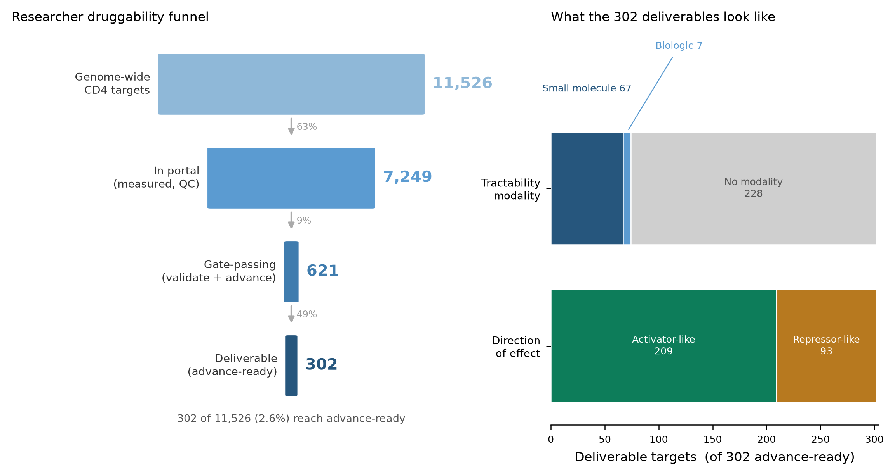
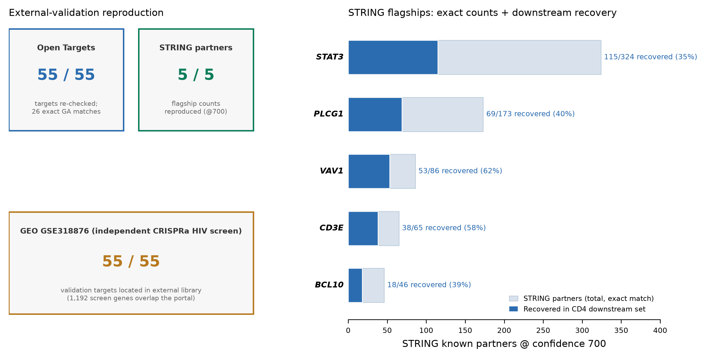
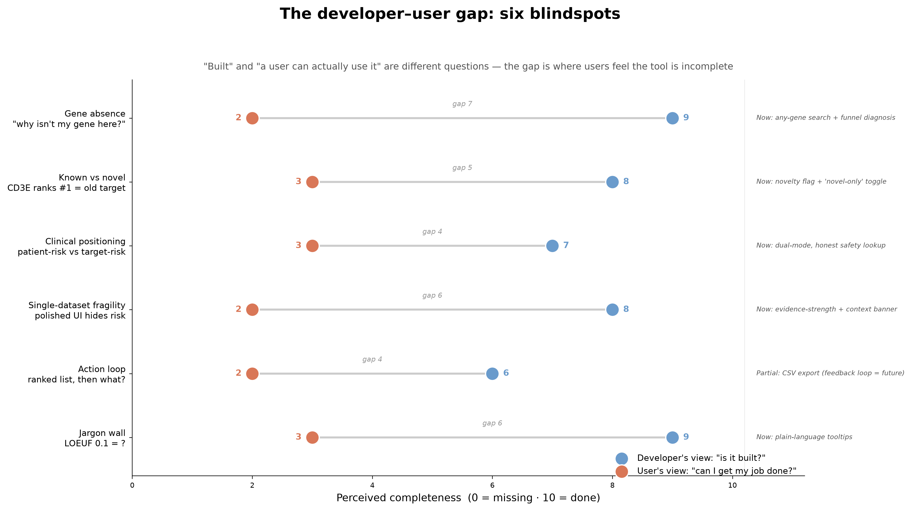

# GWT_perturbseq_analysis
Analysis of genome-wide perturb-seq screen on primary T cells (see our [manuscript](https://www.biorxiv.org/content/10.64898/2025.12.23.696273v1))

## Contents

- `src` - analysis code
    - `1_preprocess/` - ingest and preprocess new experiments from cellranger outputs
    - `2_embedding/` - cell state embedding
    - `3_DE_analysis/` - differential expression analysis
    - `4_polarization_signatures/` - analysis of polarization signatures
    - `5_cytokine_regulators/` - analysis of cytokine regulators
    - `6_functional_interaction/` - functional interaction analysis
    - `7_1k1k_analysis/` - 1k1k dataset analysis
    - `8_lymphocyte_counts_LoF/` - lymphocyte counts loss-of-function analysis
    - `_misc/` - miscellaneous utility scripts
- `metadata` - sample and experimental metadata, configs, gene annotations etc

Please refer to the [figure map](https://github.com/emdann/GWT_perturbseq_analysis_2025/blob/master/metadata/figure_map.md) to find which scripts were used to generate a specific figure in the manuscript.

## At a glance

**The druggability funnel — genome-wide screen to an advance-ready shortlist.** 11,526 measured CD4⁺ targets narrow through QC and gate-passing to 302 advance-ready candidates; the right panel breaks those down by tractability modality and direction of effect.



**External validation — the calls reproduce against independent public data.** Open Targets disease associations (55/55, 26 exact GA matches), STRING known-partner recovery for the flagship targets (@confidence 700), and an independent CRISPRa HIV screen (GEO GSE318876).



**What we built vs. what a user needs — six developer/user blindspots and how the portal closes each.** The gap between "is it built?" and "can I get my job done?" drove the two-perspective UI, plain-language tooltips, novelty flags, honest-safety lookup, and evidence-strength banners.



## Target-discovery toolkit quickstart

On top of the manuscript analysis code above, this repo also ships a **target-discovery toolkit**:
a FastAPI service (`src/3_DE_analysis/target_card_api.py`) serving prioritized, evidence-integrated
target cards over the CRISPRi screen, and a React + Vite portal (`frontend/webserver/`) with a
researcher workspace and a clinical-evidence lookup workspace. **Research / hypothesis-generating
use only — not clinical software.**

This toolkit runtime is deliberately **lighter** than the conda environment above — it does not need
scanpy/pertpy/anndata, and a fresh clone already ships a built, git-tracked reference dataset
(`frontend/webserver/public/real-dataset.json`), so there's nothing to build before you can see real
data.

```bash
# One-command run (starts the API in the background, the portal's dev server in the
# foreground; Ctrl-C stops both — see Makefile)
make dev

# Or run each piece separately, in two terminals:
make api          # http://127.0.0.1:8000 — Swagger UI at /docs; also serves the live upload tool
make web          # http://127.0.0.1:5173 — the React portal (Vite dev server)
```

The portal is a **static build**: it reads its data from the pre-exported
`frontend/webserver/public/real-dataset.json` at startup and does not call the live API for
browsing (see `frontend/webserver/README.md`). It is generated by the canonical, active reference
dataset `a6bba17b-f194-4a50-8cf8-96e03eededd6` — the current 39-column `card_schema/v2` target-card
schema, passing `validate_cards(strict=True)`, and the canonical dataset named in
[`docs/human_validation_protocol.md`](docs/human_validation_protocol.md). Regenerate it after a
target-card rebuild with `python3 frontend/webserver/scripts/export_real_data.py --force`.

The older git-tracked dataset `e7ecd8d5-5463-43e3-9bf1-6e8a15d3e137` is retained only as a
**deprecated/legacy** reference and regression-test fixture (see
`sources/target_tool_cache/e7ecd8d5-.../DEPRECATED.md`). It has the old 31-column schema, fails
strict card validation, and is missing the eight v2 columns `kd_status`, `kd_threshold_version`,
`druggable_class`, `tractability_modality`, `safety_note`, `condition_specificity_zscore`,
`effect_direction_flip_flag`, and `target_baseline_expression`; its metadata also contains stale
Windows-style source paths. It is excluded from the API's default dataset selection
(`GET /api/datasets` sorts it last and flags `deprecated: true`). Do not use it for new validation
or reviewer-facing demos unless you are explicitly reproducing legacy behavior.

**How to identify the active validated dataset:** before sharing a `dataset_id`, check the
"Active-dataset banner" in [`docs/human_validation_protocol.md`](docs/human_validation_protocol.md)
and the cache/versioning guidance in [`docs/cache_and_versioning_policy.md`](docs/cache_and_versioning_policy.md).
The active dataset should match the current schema version, pass strict validation, and have clean
metadata provenance; older UUIDs are immutable snapshots and may be stale.

For the full data-provenance/reproducibility record (what's real vs. sparse/seed-only, exact
coverage numbers, versioning) see [`docs/REPRODUCIBILITY.md`](docs/REPRODUCIBILITY.md) — the
portal's own `unknown != 0` discipline and `advance`/`grade` glossary are explained there and
inside the app itself.

### Upload your own screen (live)

After `make api`, open **`http://127.0.0.1:8000/upload`** — a standalone page that stages a CSV
DE table through the real pipeline (upload → column-mapping → approve → merge) and shows the actual
readiness call from the same engine that scores the reference dataset. It talks only to the live
`/api/imports/*` endpoints, and is kept separate from the static React portal (`frontend/webserver/`,
which is frozen for release). Guide-less uploads are honestly reported: on-target knockdown is
`not_assessed` (genuinely unknown, `unknown != 0`) and grade is capped accordingly.

### Limitations

This platform is based on primary human CD4⁺ T cell CRISPRi Perturb-seq across Rest/Stim8hr/Stim48hr conditions, with limited donors, transcriptomic readouts, and hypothesis-generating interpretation only. Results require orthogonal validation such as independent guides, donor replication, protein/functional assays, and disease-context models before therapeutic interpretation.

## Set-up compute environment

```
conda env create -f environment.yaml
conda activate gwt-env
```

## Data pointers

Processed data (cell-level count matrices, pseudobulk-level count matrices and differential expression estimates, analysis results) are available via the [Biohub Virtual Cells Platform](https://virtualcellmodels.cziscience.com/dataset/genome-scale-tcell-perturb-seq). Run the following AWS CLI command in your terminal to explore the available data:
```
aws s3 ls --no-sign-request s3://genome-scale-tcell-perturb-seq/marson2025_data/
``` 
A detailed description of shared files can be found [here](https://github.com/emdann/GWT_perturbseq_analysis_2025/blob/master/metadata/data_sharing_readme.md).

Additional supplementary tables and metadata are available [here](https://github.com/emdann/GWT_perturbseq_analysis_2025/tree/master/metadata)
Raw sequencing data and cellranger outputs will be made available through SRA/GEO (accession: SRP643211 / GSE314342)

## Citation

If you use this data or code in your work, please cite

Zhu R., Dann E. et al. (2025) Genome-scale perturb-seq in primary human CD4+ T cells maps context-specific regulators of T cell programs and human immune traits. _bioRxiv_

## Contact

For any questions, please post an [issue](https://github.com/emdann/GWT_perturbseq_analysis_2025/issues?q=sort%3Aupdated-desc+is%3Aissue+is%3Aopen) in this repository, or contact by email `emmadann<at>stanford.edu` or `ronghui.zhu<at>gladstone.ucsf.edu`. 
