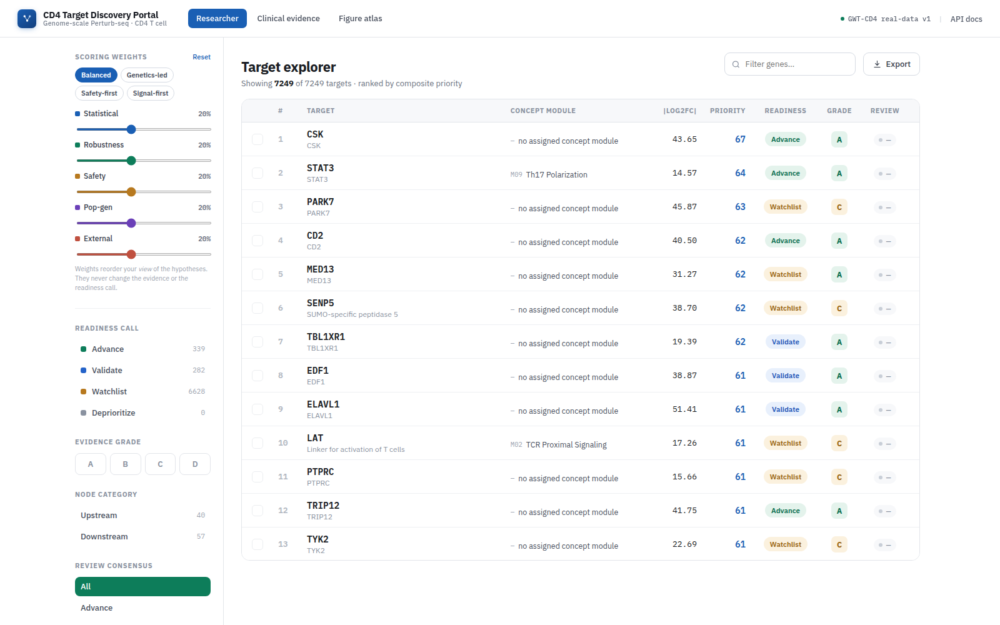
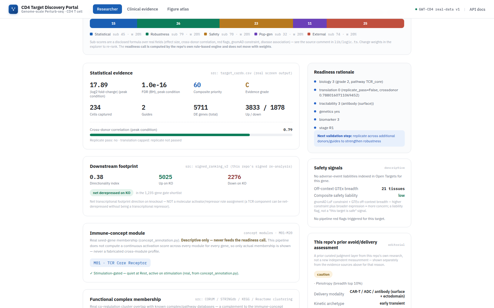

# GWT_perturbseq_analysis
Analysis of genome-wide perturb-seq screen on primary T cells (see our [manuscript](https://www.biorxiv.org/content/10.64898/2025.12.23.696273v1))

## Contents

- `src` - analysis code
    - `1_preprocess/` - ingest and preprocess new experiments from cellranger outputs
    - `2_embedding/` - cell state embedding
    - `3_DE_analysis/` - differential expression analysis
    - `4_polarization_signatures/` - analysis of polarization signatures
    - `5_cytokine_regulators/` - analysis of cytokine regulators
    - `6_functional_interaction/` - functional interaction analysis
    - `7_1k1k_analysis/` - 1k1k dataset analysis
    - `8_lymphocyte_counts_LoF/` - lymphocyte counts loss-of-function analysis
    - `_misc/` - miscellaneous utility scripts
- `metadata` - sample and experimental metadata, configs, gene annotations etc

Please refer to the [figure map](https://github.com/emdann/GWT_perturbseq_analysis_2025/blob/master/metadata/figure_map.md) to find which scripts were used to generate a specific figure in the manuscript.

## Target-discovery toolkit quickstart

On top of the manuscript analysis code above, this repo also ships a **target-discovery toolkit**:
a FastAPI service (`src/3_DE_analysis/target_card_api.py`) serving prioritized, evidence-integrated
target cards over the CRISPRi screen, and the **CD4 Target Discovery Portal**
(`frontend/webserver/`) — a React web app with a researcher workspace and a clinical-evidence
lookup workspace, rendering real statistics, readiness calls, and evidence for **7,249 real
targets** from this repo's own pipeline. **Research / hypothesis-generating use only — not
clinical software.**

|  |  |
|---|---|
|  |  |
| **Target explorer** — every one of the 7,249 real targets, ranked by an adjustable composite-priority score (statistical strength, robustness, safety, population genetics, external evidence), faceted by readiness call and evidence grade. | **Target dossier** — every number on this page is real and source-stamped: screen statistics, a rule-based readiness call, this repo's own signed footprint re-analysis, concept-module and functional-complex membership, disease associations, gnomAD constraint, an independent-screen-replication check, and (clearly labeled apart from the raw evidence) this repo's own prior curated risk assessment. |

### Installation

This toolkit runtime is deliberately **lighter** than the conda environment above — the webserver
doesn't need scanpy/pertpy/anndata, and a fresh clone already ships a built, git-tracked real
dataset (`frontend/webserver/public/real-dataset.json`), so there's nothing to build before you
can see real data.

```bash
# Node 18+ and npm are the only prerequisites for the webserver.
make webserver          # installs frontend/webserver's npm deps, then starts it
# -> http://localhost:5173

# Optional: the FastAPI service, if you want to hit the JSON API directly
make api                # installs src/3_DE_analysis's Python deps, then starts it
# -> http://127.0.0.1:8000 — Swagger UI at /docs
```

Or by hand:

```bash
cd frontend/webserver
npm install
npm run dev              # http://localhost:5173
```

### Usage

Open `http://localhost:5173` — no `dataset_id`, no backend, no build step needed; the real dataset
is fetched once at startup from the committed `public/real-dataset.json`.

- **Researcher** (top nav) — the target explorer above. Drag the scoring-weight sliders to re-rank
  by what you care about (they reorder your *view*, never the underlying evidence or readiness
  call); filter by readiness call, evidence grade, or concept module; click any row to open its
  full dossier; shortlist targets and open the side-by-side **Compare** view.
- **Clinical evidence** (top nav) — scope & guardrails, per-concept-module profiles (M01–M20),
  a disease × drug evidence match, and a population-genetics constraint lookup.
- **Figure atlas** — 8 interactive figures. **Still illustrative demo data**, not yet wired to
  real outputs — every figure's own caption says so.
- Every panel that has no real data for a given target says `unknown` — never a fabricated value.
  See [`frontend/webserver/README.md`](frontend/webserver/README.md) for exactly which repo file
  feeds which panel, and its current per-panel coverage.

To regenerate `real-dataset.json` after the underlying pipeline output changes, see
["Regenerating the dataset"](frontend/webserver/README.md#regenerating-the-dataset) in the
webserver's own README.

For the full data-provenance/reproducibility record for the target-card pipeline itself (what's
real vs. sparse/seed-only, exact coverage numbers, versioning) see
[`docs/REPRODUCIBILITY.md`](docs/REPRODUCIBILITY.md) — the toolkit's `unknown != 0` discipline and
`advance`/`grade` glossary are explained there.

### Limitations

This platform is based on primary human CD4⁺ T cell CRISPRi Perturb-seq across Rest/Stim8hr/Stim48hr conditions, with limited donors, transcriptomic readouts, and hypothesis-generating interpretation only. Results require orthogonal validation such as independent guides, donor replication, protein/functional assays, and disease-context models before therapeutic interpretation.

## Set-up compute environment

```
conda env create -f environment.yaml
conda activate gwt-env
```

## Data pointers

Processed data (cell-level count matrices, pseudobulk-level count matrices and differential expression estimates, analysis results) are available via the [Biohub Virtual Cells Platform](https://virtualcellmodels.cziscience.com/dataset/genome-scale-tcell-perturb-seq). Run the following AWS CLI command in your terminal to explore the available data:
```
aws s3 ls --no-sign-request s3://genome-scale-tcell-perturb-seq/marson2025_data/
``` 
A detailed description of shared files can be found [here](https://github.com/emdann/GWT_perturbseq_analysis_2025/blob/master/metadata/data_sharing_readme.md).

Additional supplementary tables and metadata are available [here](https://github.com/emdann/GWT_perturbseq_analysis_2025/tree/master/metadata)
Raw sequencing data and cellranger outputs will be made available through SRA/GEO (accession: SRP643211 / GSE314342)

## Citation

If you use this data or code in your work, please cite

Zhu R., Dann E. et al. (2025) Genome-scale perturb-seq in primary human CD4+ T cells maps context-specific regulators of T cell programs and human immune traits. _bioRxiv_

## Contact

For any questions, please post an [issue](https://github.com/emdann/GWT_perturbseq_analysis_2025/issues?q=sort%3Aupdated-desc+is%3Aissue+is%3Aopen) in this repository, or contact by email `emmadann<at>stanford.edu` or `ronghui.zhu<at>gladstone.ucsf.edu`. 
