# 圖表導讀 Figure Reading Guide(給科研人員)

> 本文件把 codebase 內既有的分析圖表整理成**正式的閱讀路徑**,引導研究人員依「資料概覽 → 分佈結構 → 穩健性 → 篩選漏斗 → 排序與模組 → 情境動力學 → 方法學驗證 → 決策層」的順序判讀。每張圖附出處(產生腳本 / 來源資料)、如何讀、可下什麼結論與注意事項。
>
> **底層資料**:`DE_stats.suppl_table.csv`(33,983 列 = 11,526 唯一標的 × 3 條件;MD5 `f5cf2e07…`)[1]。
> **三條件固定配色**:Rest = 藍 / Stim8hr = 橙 / Stim48hr = 綠(全部圖表一致)。
> **可重現**:精修圖表目錄 `docs/mvp-research/pipeline/05_visualization/refined_figures/REFINED_CATALOG_53.md`;8 張關鍵圖的譜系稽核(產生腳本 + 重算數字)見 `docs/mvp-research/pipeline/reproducibility_audit/figure_registry.md`。
> **科普簡化版**:對一般讀者的簡化示意圖見科普導覽網站 `docs/explainer/index.html`。

---

## 0. 全域關鍵統計(圖表標註的共同基準)

來源:`05_visualization/README.md`(04_statistical 摘要)。

| 指標 | 值 |
|---|---|
| 總列數 `n_rows` / 唯一標的 `n_unique_targets` | 33,983 / 11,526 |
| on-target 顯著列 / off-target 旗標列 | 21,216 / 2,837 |
| 通過品質門檻列 / 對應唯一標的 | 2,131 / 1,235 |
| 下游 DE 基因數 `n_total_de_genes` | 中位 2、最大 5,920(強右偏,分佈圖多取 log10) |
| on-target 效應量 `ontarget_effect_size` | 範圍 −58.5 ~ 7.1、中位 −6.3 |
| `logDE < 1`(下游 ≤8 基因)比例 | 75.6% |

| 條件 | 列數 | 上調基因總和 | 下調基因總和 |
|---|---:|---:|---:|
| Rest | 11,287 | 371,945 | 227,402 |
| Stim8hr | 11,415 | 506,326 | 280,429 |
| Stim48hr | 11,281 | 392,533 | 277,789 |

> ⚠️ **批次注意**:`Stim48hr` 完全落在 `CD4i_R2` run,故任何 Stim48hr 專一宣稱需帶 run/batch caveat(見 `sources/topic09_eda_report.md`)。

---

## 1. 資料概覽與品質(EDA)

三張摘要層 EDA 圖(來源 `sources/topic09_eda_outputs/`,由 supplementary tables 直接產生)。

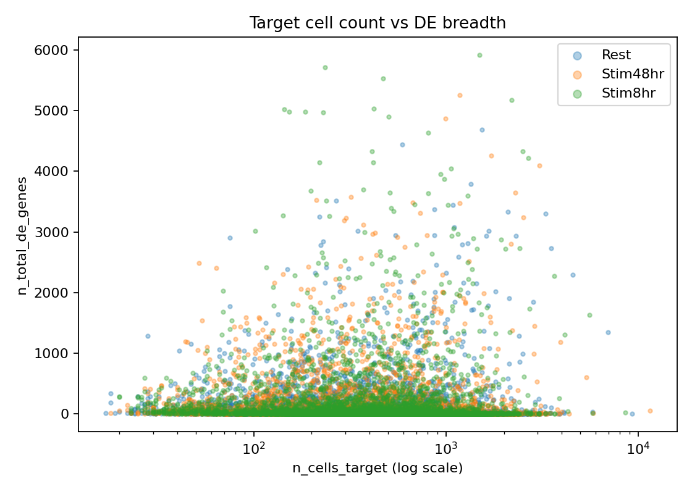

**圖 1.1 — 每標的細胞數 vs 下游 DE 基因數。** x、y 皆 log。**如何讀**:左下密集雲代表大多數擾動即使細胞數充足,下游 DE 仍很少;右上稀疏尾為高影響擾動。**結論**:偵測到強效應**不是**單純細胞數不足造成的假陰性——功效與效應大小是可分離的。此圖同時界定後續 `n≥200 cells` 品質門檻的合理性。

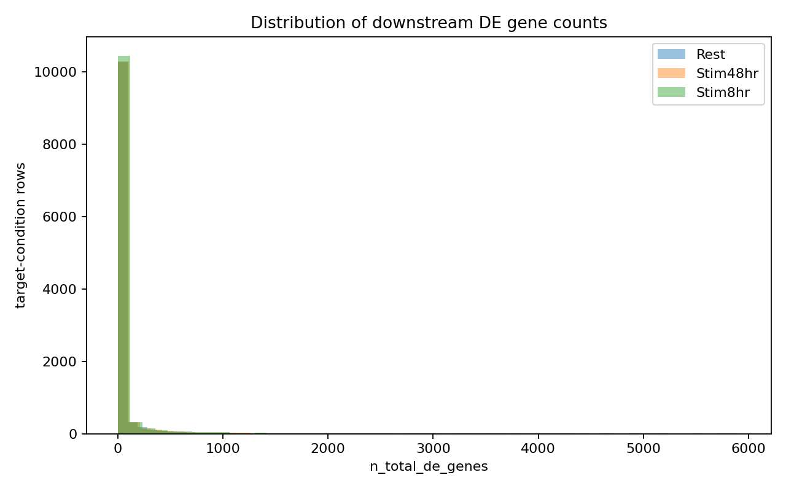

**圖 1.2 — 三條件的 `n_total_de_genes` 分佈。** **如何讀**:三條件曲線幾乎重合、強烈右偏;眾數為 1 個下游 DE 基因(count = 7,316)。**結論**:擾動效應為長尾;三條件的**整體**分佈相似,差異藏在高影響尾(見圖 2、6)。Rest / Stim8hr / Stim48hr 的平均 DE 基因數分別約 53.1 / 68.9 / 59.4,Stim8hr 尾最重,符合急性 TCR 刺激生物學。

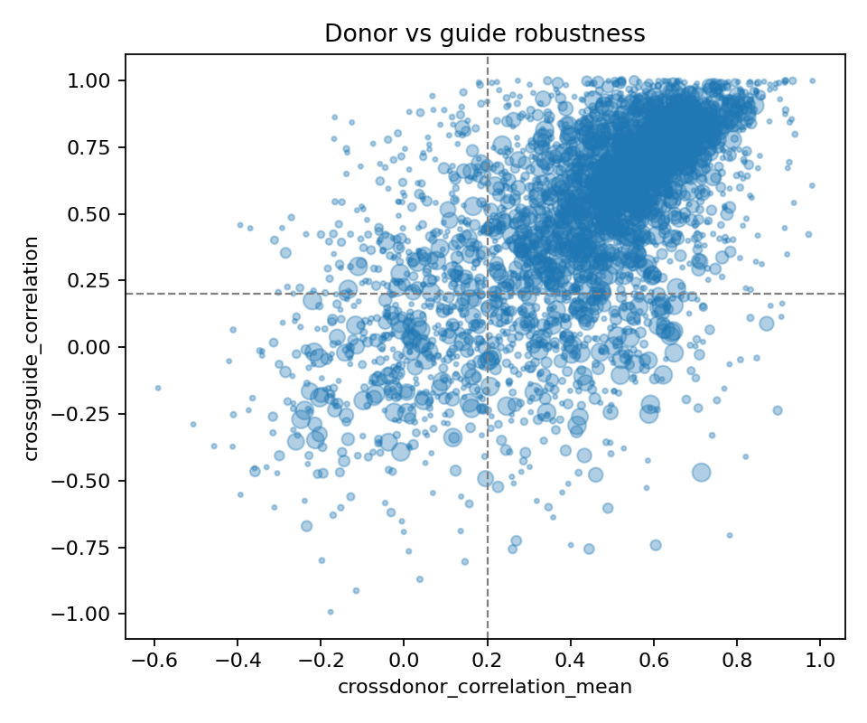

**圖 1.3 — 跨捐贈者相關 vs 跨 guide 相關(穩健性雙軸)。** **如何讀**:右上象限(兩軸皆高)= 效應在**不同捐贈者**與**不同 gRNA**間都可重現;近原點 = 雜訊。**結論**:這是把「統計顯著」升級為「可重現、可因果判讀」的核心憑據,也是 `readiness_engine` 之 `replicate_pass_flag`(要求跨 donor ∧ 跨 guide 同時穩健、≥2 guides)的視覺依據。

---

## 2. 擾動效應的分佈結構(long-tail)

「分佈族」代表圖(`refined_figures/`,logDE = log10(n_total_de_genes+1))。

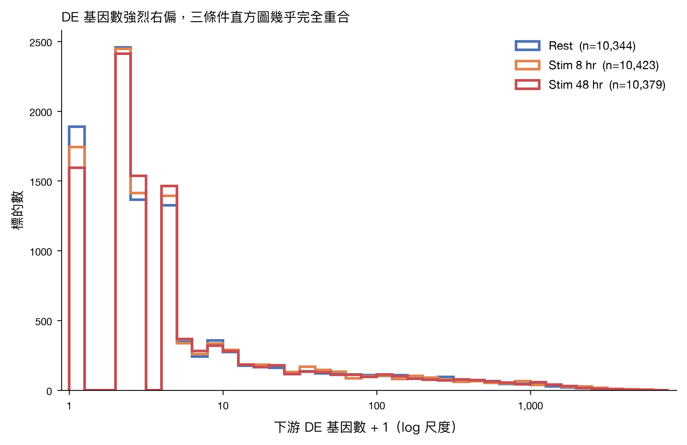
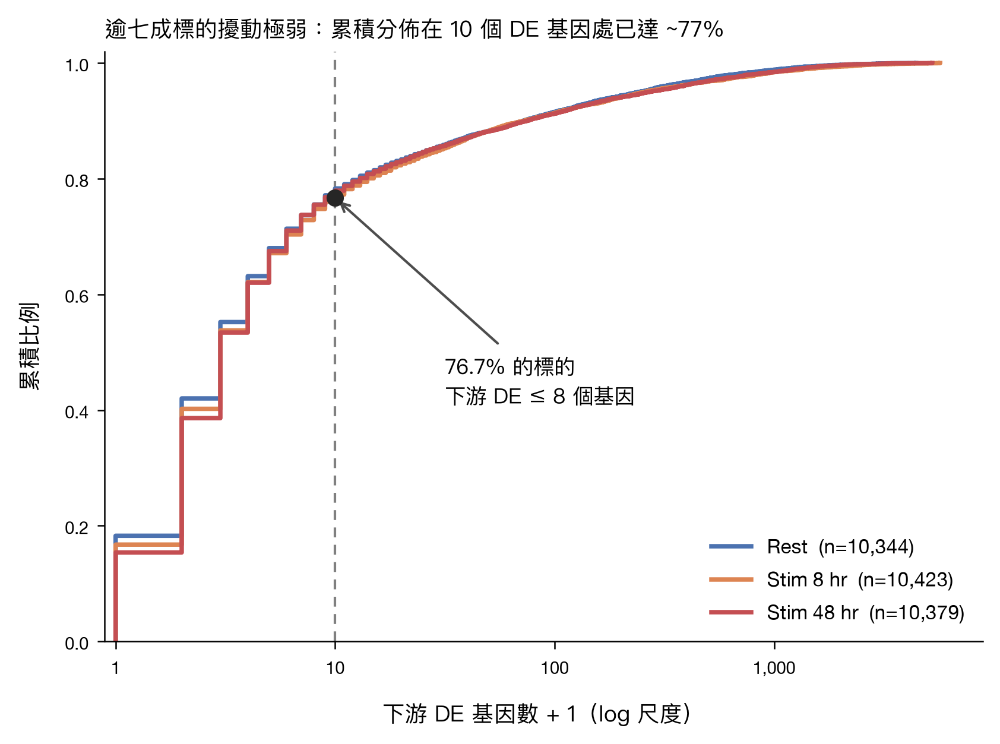

**圖 2.1 / 2.2 — logDE 直方圖與 ECDF。** **如何讀**:直方圖三條件近乎完全重合、強右偏;ECDF 標註了「76.7%(off-target 排除集)標的下游 DE ≤ 8 基因(logDE < 1)」的位置。**結論**:全基因體擾動絕大多數為**稀疏**訊號,少數高影響標的驅動了高平均——這正是需要「篩選漏斗」把訊號從雜訊中濃縮的原因(見第 4 節)。

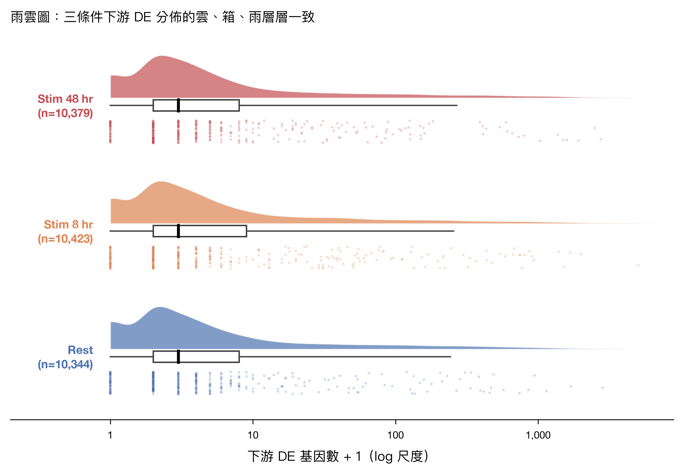

**圖 2.3 — 雨雲圖(raincloud)。** 半小提琴(密度)+ 箱(5–95% 鬚)+ 抖動點三層合一,同時呈現分佈形狀、集中趨勢與原始點密度,是分佈族中資訊量最完整者。

> 其餘分佈族(小提琴 D1、箱 D2、脊線 D3、strip D6、swarm D7、KDE D9、Q-Q D10)為同一分佈的不同呈現,完整清單見 §9 目錄。

---

## 3. 穩健性與品質門檻通過集

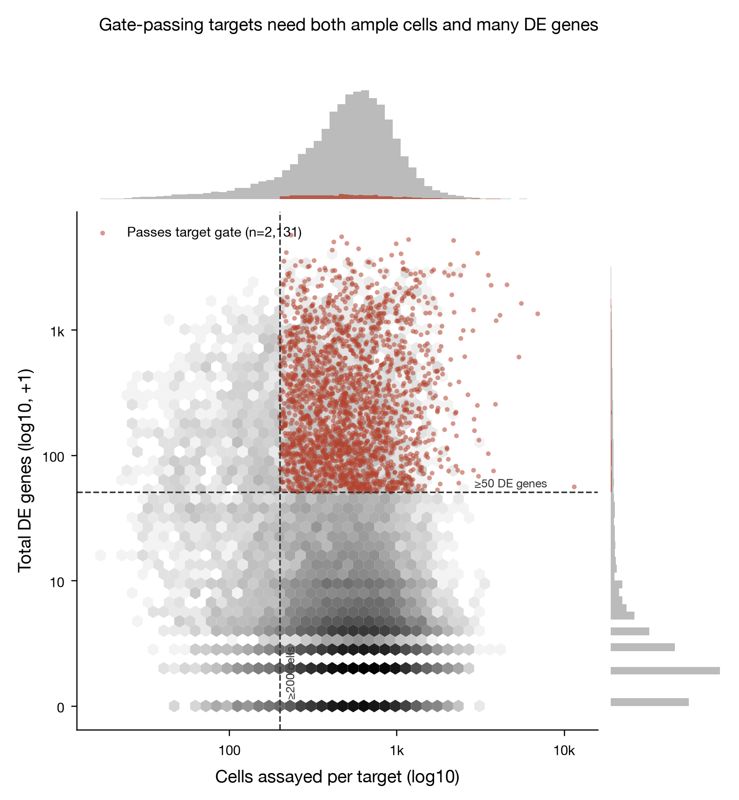

**圖 3.1 — 細胞數 vs 下游 DE 的 joint hexbin,疊上通過門檻的 2,131 列(紅)。** **如何讀**:灰底為全體,紅點為通過四關品質門檻者。**結論**:通過集集中在「細胞數足夠且下游 DE 廣」的區域,直觀顯示門檻並非隨機取樣,而是朝可重現的高影響標的收斂。與圖 1.3(跨 donor/guide)互補:一為功效面、一為重現面。

---

## 4. 篩選漏斗(curation gate)

把 33,983 列基因體訊號濃縮為可行動 shortlist 的多關級聯。

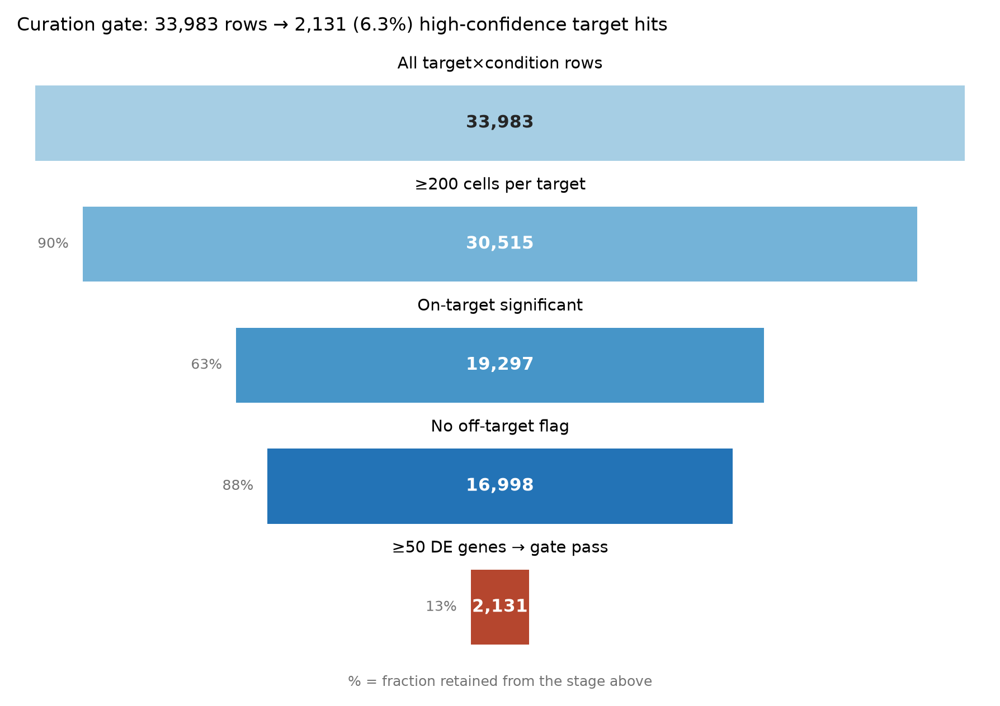
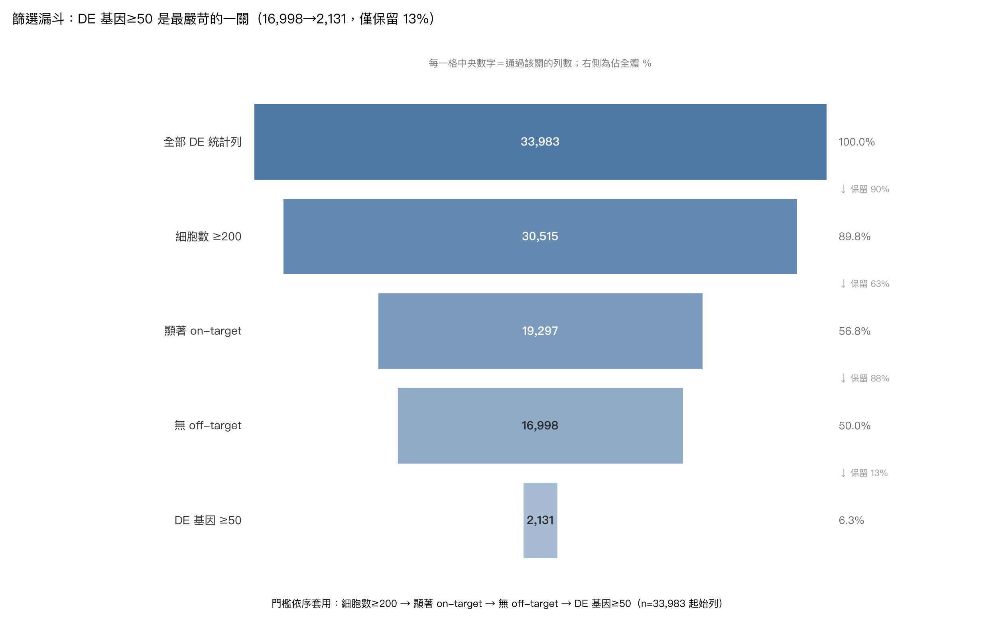

**圖 4.1 / 4.2 — 品質門檻漏斗。** 四關級聯:全部 33,983 → 細胞數 ≥200 → on-target 顯著 → 無 off-target → 下游 DE ≥50,最終 **2,131 列(約 6.3%)= 1,235 唯一標的**。**如何讀**:最嚴一關為「下游 DE ≥50」(逐關保留率最低,約 13%)。**結論**:基因體篩選以稀疏雜訊為主,但門檻能把它濃縮為緊湊的標的短名單。

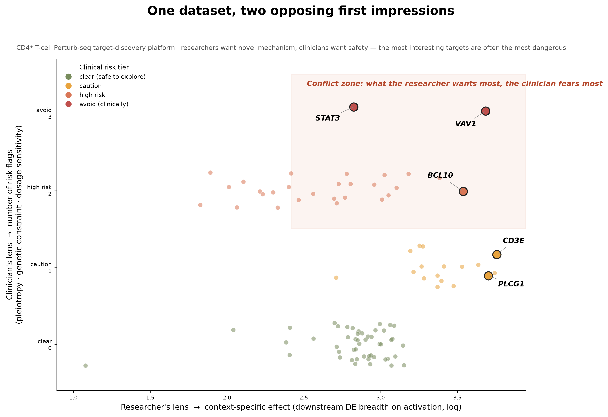

**圖 4.3 — 整合敘事封面圖(雙視角)。** 對應 `figure_registry.md` 之 `Figure1_integrated_story`:五面板(schematic 漏斗、curation-gate 長條、稀疏/廣度證據、三個回復的調控模組、TCR 情境專一性)。**關鍵結論**:33,983 個擾動剖面經多重過濾濃縮至 2,131(6.3%)= 1,235 唯一標的;最強命中重現 **TCR 近端訊號 / SAGA / Mediator-CDK** 三模組;擾動稀疏(中位 2 DE 基因;廣度 vs 細胞數 ρ = −0.18)。

---

## 5. 標的排序與調控模組

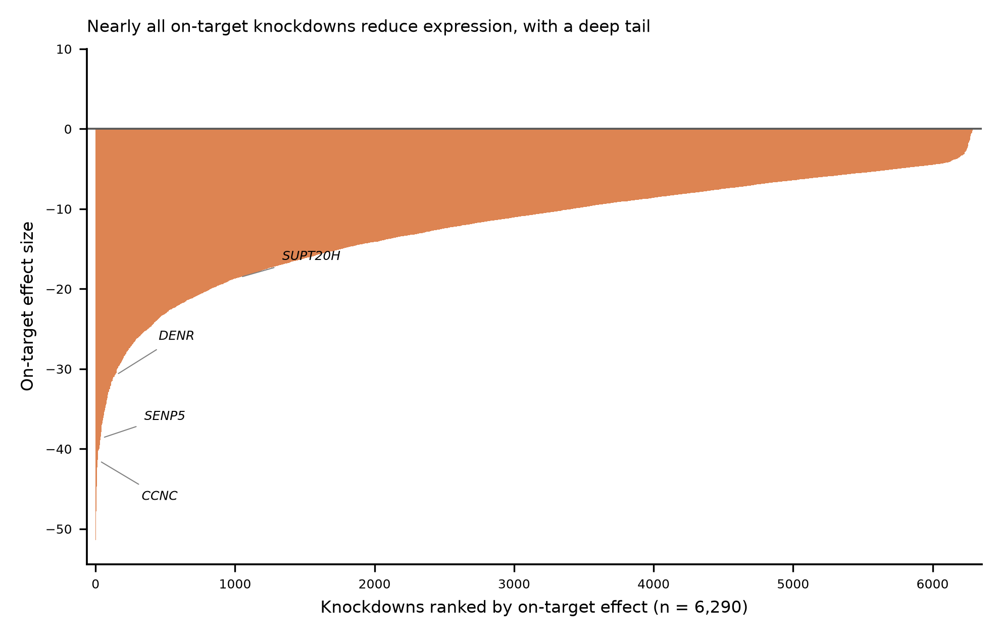

**圖 5.1 — Stim8hr 全部 6,290 個 on-target 顯著敲低的瀑布圖(依帶號在標效應量排序)。** **如何讀**:負向長條為成功敲低(CRISPRi 預期方向)。**結論**:提供敲低強度的全景分佈,是挑選「敲低確認」標的的視覺入口。

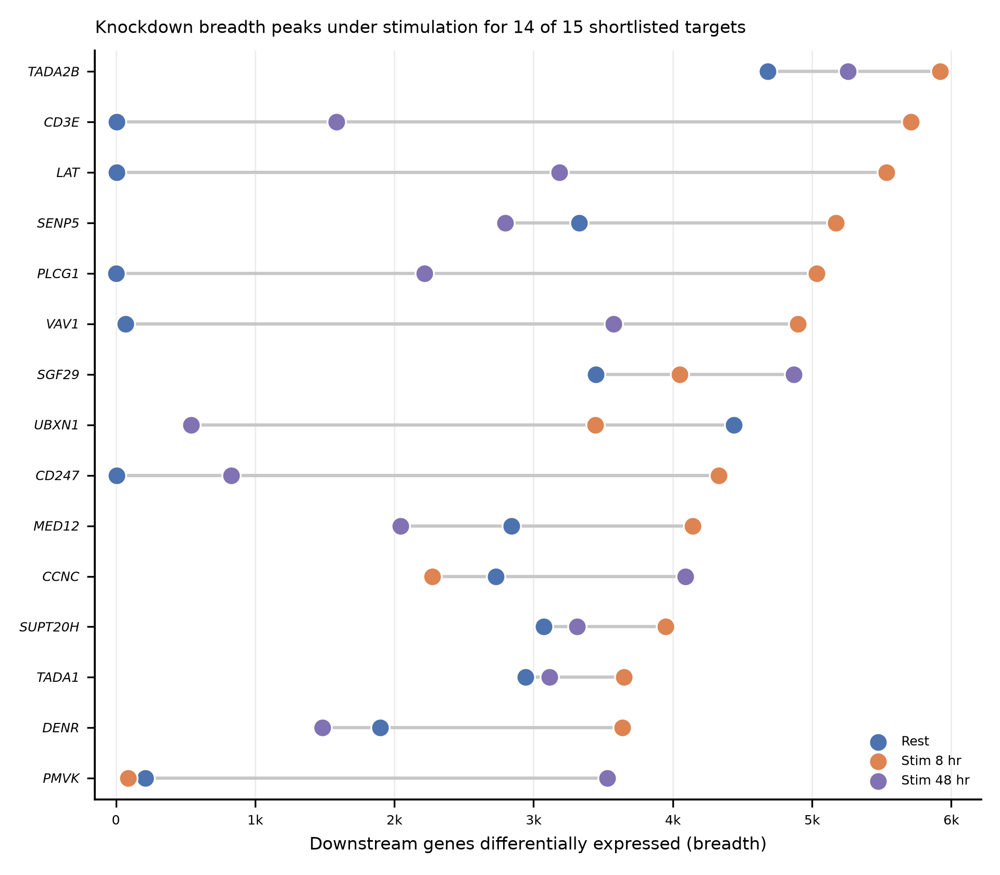

**圖 5.2 — 15 個 shortlist 基因依下游 DE 廣度排序(lollipop)。** claim-title 對每列為真(誠實標註例外);excluded/off-target 以開口標記且不入摘要。

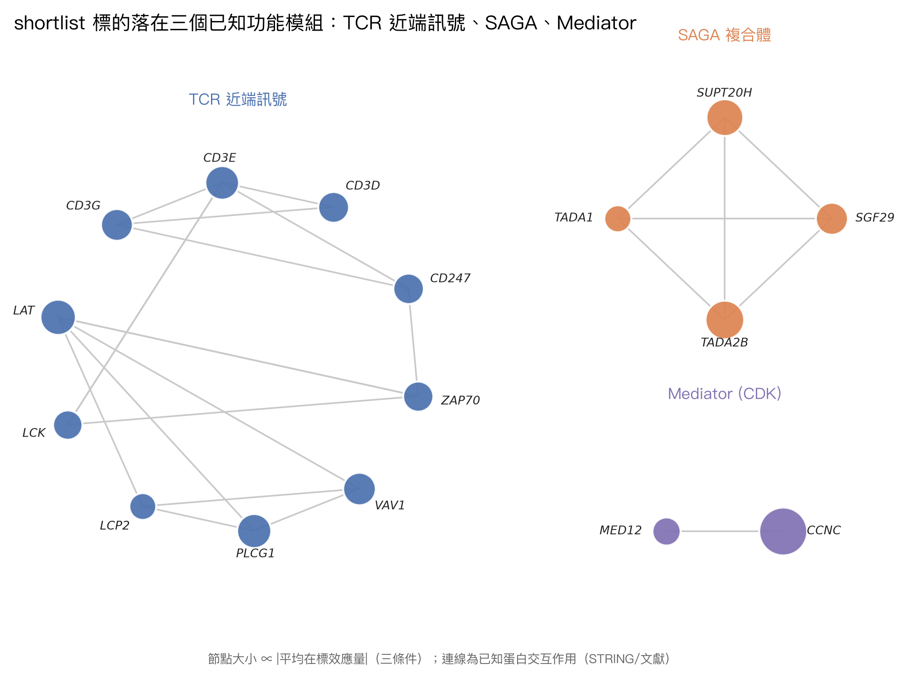
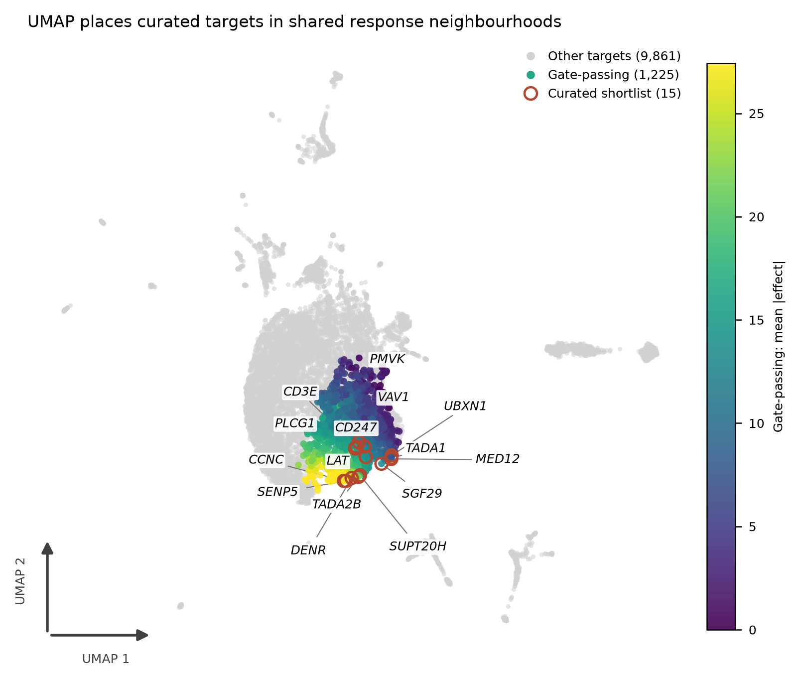

**圖 5.3 / 5.4 — shortlist 的已知 PPI 網路(STRING/文獻)與標的特徵 UMAP。** N1 節點色 = 功能模組(TCR 近端 / SAGA / Mediator),大小 ∝ 平均在標效應量;三模組各自內部緊密、彼此無已知直接交互。UMAP 以灰(其他)/ viridis(通過門檻)/ 環標(shortlist)呈現標的在 3 條件效應特徵空間的分佈。**結論**:排序頂端在**已知生物學**上聚成可解釋的模組,而非離散雜點。

---

## 6. 情境專一性與動力學

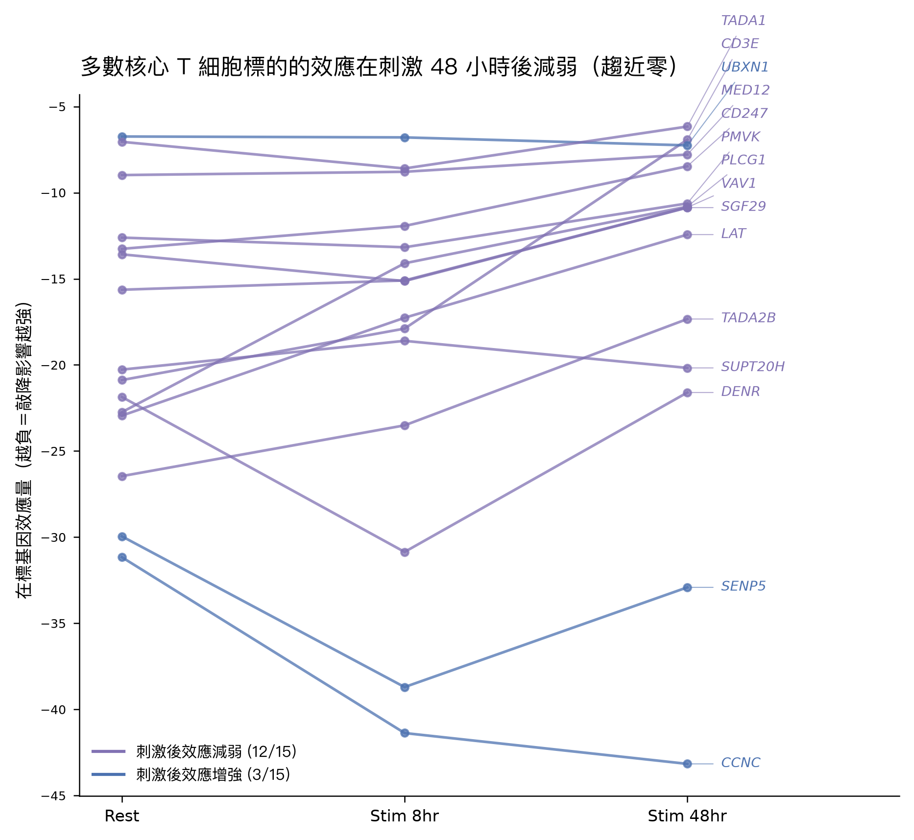

**圖 6.1 — 15 個 shortlist 基因在 Rest→Stim8hr→Stim48hr 的在標效應量斜率圖。** 色 = 刺激後減弱(12/15)/ 增強(3/15)。**如何讀**:斜率方向即「該調控子在活化過程中變得更重要或更不重要」。

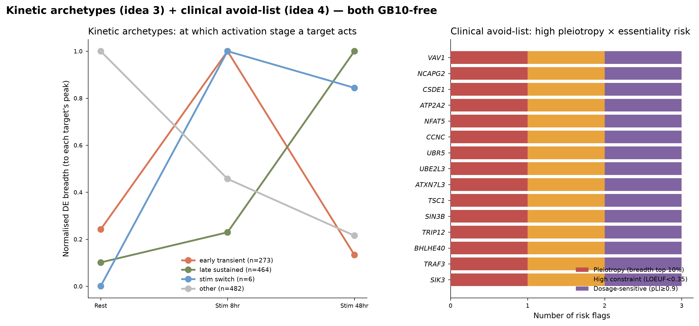

**圖 6.2 — 動力學原型(左)與臨床迴避清單(右)。** 來源 `target_master_table.csv`(`figure_registry.md` #8)。**關鍵數字**:原型分佈 482 other / 464 late-sustained / 273 early-transient / 6 stim-switch / 10 unknown;**387 個基因帶 ≥2 個臨床風險旗標**(pleiotropy / 高約束 / 劑量敏感;345 帶 2、42 帶 3)。**結論**:標的在活化時序上的作用點不同,且相當一部分帶有疊加的臨床責任,構成不宜成藥的理由——這直接對應 `readiness_engine` 的紅旗覆蓋精神。

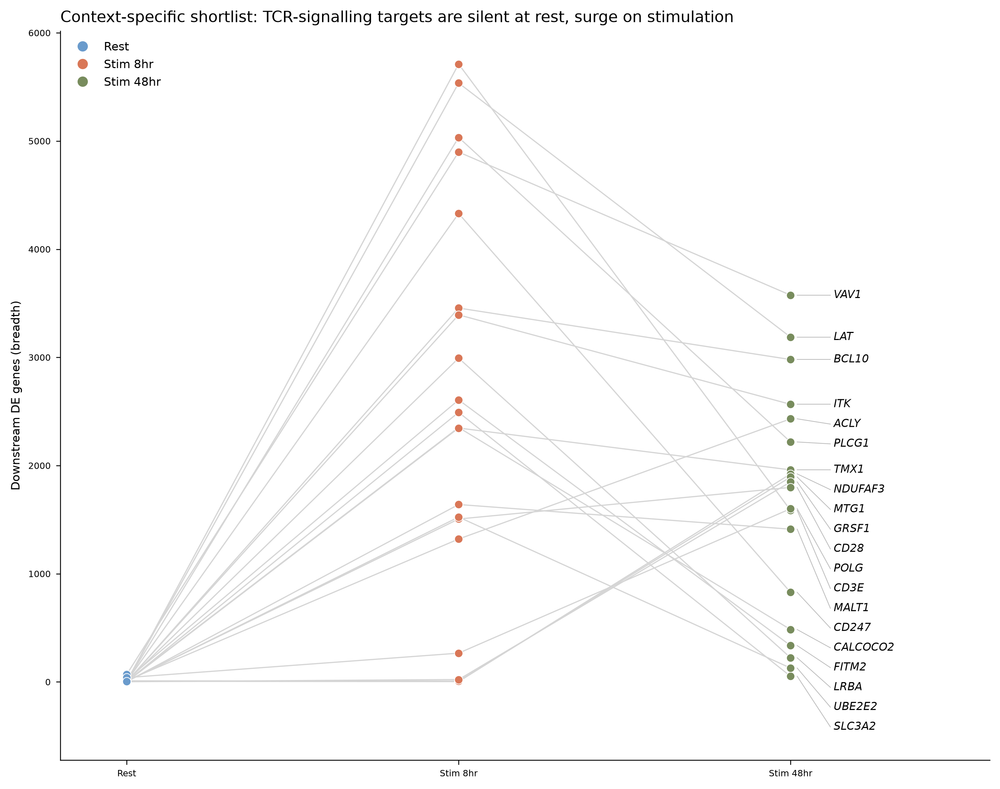

**圖 6.3 — 情境專一候選(基線校正後)。** 對應 `context_specific_corrected`:96 個情境專一候選中,以全條件 Q25 baseMean floor 分離出 **11 個表現偽影 / 84 個真調控子**。**結論**:一道基線表現下限即可濾掉「只因休息態幾乎不表現而看似情境專一」的偽命中。

---

## 7. 方法學驗證(sanity checks)

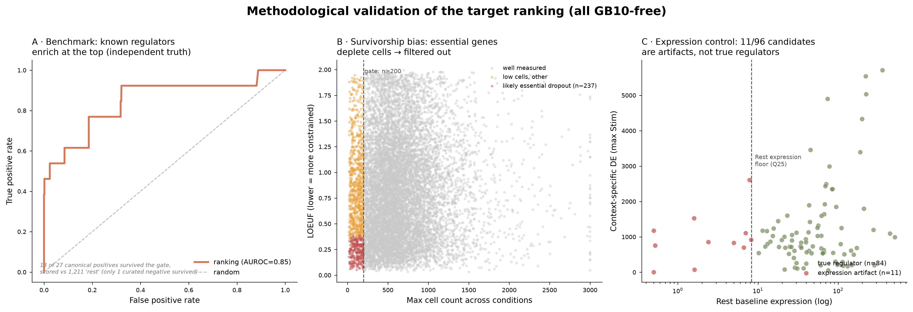

**圖 7.1 — 方法學驗證(三面板)。** 來源 `figure_registry.md` #1,數字經重算稽核。
- **Panel A(排序基準,ROC)**:對 canonical CD4 正對照的 **AUROC = 0.85**(13 正對照 vs 1,211);獨立基準另得 AP = 0.47 = 隨機基線的 **44.7×**,Mann–Whitney p = 8.8×10⁻⁶ → 排序把已知生物學顯著地推到頂端。
- **Panel B(dropout 存活者偏差)**:LOEUF vs 細胞數;**237 個基因**因高約束(LOEUF<0.35)且細胞數 <200 被標為 likely-essential dropout → 必需基因因敲除致死而系統性地被低估、掉出篩選。
- **Panel C(表現基線偽影控制)**:Rest baseline vs Stim DE;96 個候選中 11 個為低表現偽影、84 個為真調控子。

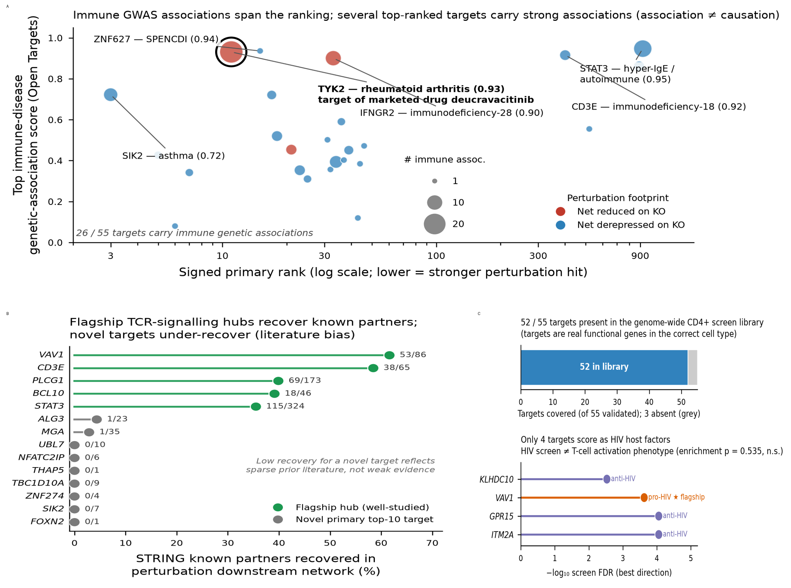

**圖 7.2 — 外部驗證圖(level 4)。** 將本平台排序對接外部證據軸;搭配 `figure_registry.md` 的 benchmark 面板,構成「排序是否回復已知生物學」的正式證據鏈。

> **誠實註記**:`dev_vs_user_gap.png` 為**概念圖**(分數寫死於腳本、非由資料算出),已於 `figure_registry.md` 明載,不應被當作資料結果解讀。

---

## 8. 決策層與可遞送性

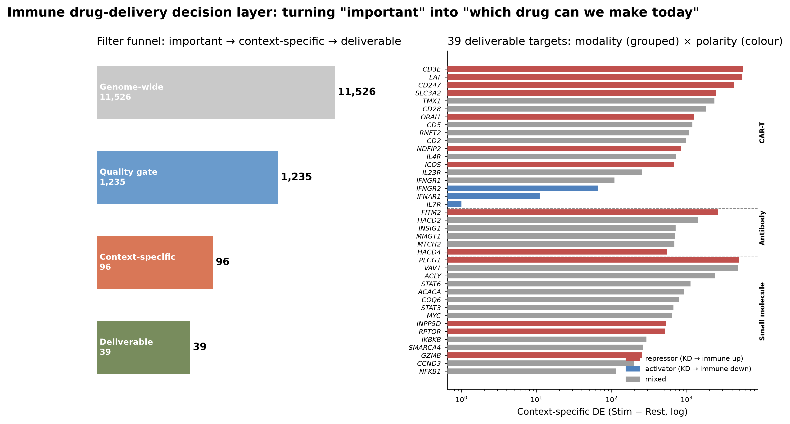

**圖 8.1 — 免疫藥物遞送決策層。** 來源 `figure_registry.md` #7。左:log 漏斗 **11,526 → 1,235 → 96(情境專一)→ 39(可遞送)**;右:39 個可遞送標的依藥物模式分組(18 CAR-T/ADC/抗體、15 小分子、6 抗體)、依敲低極性著色(23 mixed、13 repressor、3 activator)。**結論**:把「生物學上重要」翻譯成「今天做得出來的藥」——96 個情境專一標的中僅 39 個具現行可行的藥物模式。

---

## 9. 完整圖表目錄(codebase 內全部圖表)

為使 codebase 內每張圖都被正式收錄,下列為完整索引;逐張細節見各目錄檔。

### 9.1 精修出版級圖庫(53 張)
路徑 `docs/mvp-research/pipeline/05_visualization/refined_figures/`;完整清單與逐張說明:[`REFINED_CATALOG_53.md`](mvp-research/pipeline/05_visualization/refined_figures/REFINED_CATALOG_53.md)(機器可讀版 `REFINED_CATALOG_53.csv`)。六族:

| 族 | 張數 | 內容 | 代表(本文已導讀) |
|---|---|---|---|
| 分佈 D1–D10 | 10 | violin/box/ridgeline/histogram/ECDF/strip/swarm/raincloud/KDE/Q-Q | D4、D5、D8(§2) |
| 矩陣 M1–M10 | 10 | 相關/聚類熱圖、hexbin、密度散點、散點矩陣、joint、dendrogram、contour、gene×condition | M7(§3) |
| 排序 R1–R10 | 10 | lollipop/diverging/stacked/waterfall/bubble/grouped/errorbar/point/MA/dotmatrix | R1、R4(§5) |
| 降維複合 C1–C3, V1–V6 | 9 | 3D dot、volcano、QC funnel、PCA/t-SNE/UMAP/radar/circular/biplot | C3(§4)、V3(§5) |
| 網路 N1–N7 | 7 | STRING/chord/venn/manhattan/slope/stacked-area/UpSet | N1、N5(§5/§6) |
| 階層互動 H1–H7 | 7 | treemap/sunburst/icicle/sankey/funnel/parallel-coords/parallel-categories | H5(§4) |

### 9.2 Pipeline 決策與驗證圖(8 張,經譜系稽核)
路徑 `docs/mvp-research/pipeline/…`;稽核見 [`figure_registry.md`](mvp-research/pipeline/reproducibility_audit/figure_registry.md):`methodological_validation`、`benchmark_pr_roc`、`dropout_diagnosis`、`context_specific_corrected`、`Figure1_integrated_story`(cover)、`delivery_decision_funnel`、`kinetics_and_avoid`、`dev_vs_user_gap`(概念圖)。另含 `evidence_coverage_fix.png`、`level4_external_validation_figure.png`、`signed_de_application/signed_application_figure.png`。

### 9.3 視覺化原型圖庫(gallery)
路徑 `docs/mvp-research/visualization/figures/`:`gallery_1_distributions` / `gallery_2_matrices` / `gallery_3_ranking` / `gallery_4_dimred` / `gallery_5_networks` / `viz_dotplot_3d` / `viz_prototype_4panel`。

### 9.4 論文分析結果圖(manuscript,SVG)
由論文原始流程產生,對應 `metadata/figure_map.md`(圖 → 腳本對照):
- `src/4_polarization_signatures/results/`:`Th1_Th2_singlecell_signature.svg`、`Th2_singlecell_signature_main.svg`、`arce_activation_volcano.svg`
- `src/6_functional_interaction/results/`:`diseasegenes_barplots_cluster38/79/80.svg`

---

## 參考

1. Zhu R., Dann E. et al. (2025) Genome-scale perturb-seq in primary human CD4⁺ T cells maps context-specific regulators of T cell programs and human immune traits. *bioRxiv* `10.64898/2025.12.23.696273`.

> 圖表數字如與各圖來源檔或 `figure_registry.md` 稽核值衝突,以後者為準。方法學脈絡見 [`technical_methods.md`](technical_methods.md);圖 → 腳本對照見 `metadata/figure_map.md`。
