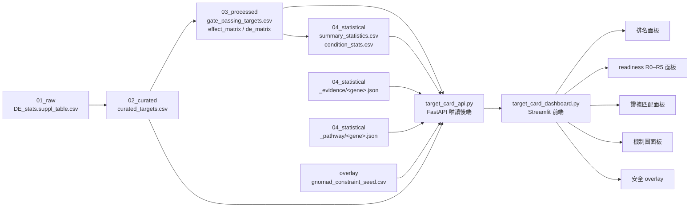

# 07 · Dashboard 層 — 整合展示層（Streamlit + FastAPI）

## 這一層是什麼
Pipeline 最下游的**整合展示層（消費端）**。它本身不產生新的科學資料，而是把 01→04 各層產出的表與快取**收攏成使用者可互動的標的候選卡（target cards）**。兩個腳本構成前後端：

| 腳本 | 角色 | 技術 | 對應 stage_manifest |
|---|---|---|---|
| `target_card_dashboard.py` | 前端互動儀表板 | Streamlit | `07_dashboard / 腳本 / repo` |
| `target_card_api.py` | 唯讀 REST 後端 | FastAPI | `07_dashboard / 腳本 / repo` |

> **來源說明**：這兩個 `.py` 腳本存放於雲端 GitHub repo（見 `MVP_開發目標與資料簡報.md` §3 已存在實作），不在本專案 artifact store 內。本文件依據 MVP 架構文件與各上游層實測 schema 整編，描述「儀表板讀哪些上游、各面板/端點對應哪一層哪些欄位」，作為 pipeline 的 07 階段文件。

三系統共用**同一套卡片契約 + readiness engine + provenance 版本戳**，展示層對三者一視同仁：
- **系統一**：內部 GWT DE 資料 → 排序 target cards（本 MVP 主線）。
- **系統二**：使用者上傳 → 同規則評分 → `usr_` 卡片。
- **系統三**：外部臨床/人群證據 → 填補 readiness 的 `unknown` 領域。

---

## 在 pipeline 中的定位
展示層是唯一「往回讀所有層」的節點——原始統計、策展門檻、效應矩陣、全域摘要、外部證據與機制快取全部在此匯流：

```
01_raw ─────────► 02_curated ─────► 03_processed ────► 04_statistical ──┐
DE_stats           curated_targets   effect/de matrix    summary_stats    │
(33,983×16)        (33,983×18)        embedding_input     condition_stats  │
                                                          _evidence/*.json │
                                                          _pathway/*.json  │
                                                                           ▼
                                                        ┌──────────────────────────┐
                                                        │  07_dashboard（消費端）    │
                                                        │  target_card_api.py 後端   │
                                                        │  target_card_dashboard.py  │
                                                        │  ├─ 面板：排名             │
                                                        │  ├─ 面板：readiness R0–R5  │
                                                        │  ├─ 面板：證據匹配         │
                                                        │  ├─ 面板：機制圖           │
                                                        │  └─ overlay：安全窗口      │
                                                        └──────────────────────────┘
        （05_visualization 圖表目錄 · 06_animation 動畫為平行的展示資產，非本層資料依賴）
```

### 資料流向（mermaid）


---

## 面板清單（各讀哪一層哪些欄位）

### ① Target 排名面板
以 trans-effect 廣度排序候選標的，突顯「泛效應基因假性領先」現象。
- **讀取層**：`03_processed/gate_passing_targets.csv`（2,131 列通過門檻／1,235 唯一標的）。
- **欄位**：`target_contrast_gene_name`、`culture_condition`(Rest/Stim8hr/Stim48hr)、`ontarget_effect_size`、`n_total_de_genes`、`n_downstream`、`n_cells_target`、`passes_gate`。
- **MVP 門檻**（於 02→03 套用）：`n_cells≥200` & on-target 顯著 & 無 off-target & `DE≥50`。
- **顯示**：Top-15 shortlist（`candidate_shortlist_top15.csv`），`immune_candidate` vs `broad_effect (quarantine→watchlist)` 以 `flag` 區分顏色。

### ② Readiness 分級面板（R0–R5）
每張卡片給一個「離臨床多遠」的分級；泛效應／必需基因被**紅旗封頂在 watchlist**。
- **讀取來源**：`readiness_engine.py` 輸出（卡片欄位）＋ 連結器 overlay。
- **分級語意（R0–R5）**：

  > ⚠️ **注意**：`readiness_engine.py` 位於雲端 repo、本專案 artifact store 內無此腳本，未能讀取其實際分級碼。下表**每一級的具體語意為推論／整編，非引自引擎原始碼**。可從來源文件證實的僅一條轉換規則：`_evidence` 快取填實遺傳/可成藥性領域後**解鎖 R3→R4**（見 `MVP_開發目標與資料簡報.md` §4 item 4）。其餘級別語意須以實際 `readiness_engine.py` 為準。

  | 級別 | 語意（推論，待引擎原始碼核對） |
  |---|---|
  | **R0** | 資料不足／未評分 |
  | **R1** | 僅有內部 DE 訊號，外部證據多為 `unknown` |
  | **R2** | 有基本標的層屬性（可成藥性或遺傳其一） |
  | **R3** | 多領域證據齊備但仍有缺口 |
  | **R4** | 遺傳＋可成藥性＋安全窗口三領域皆填實（**此 R3→R4 轉換為來源文件唯一明載規則**） |
  | **R5** | 最完整；仍**不等於**臨床就緒（產品紅線） |
  | **watchlist（封頂）** | `broad_effect` 紅旗基因，不論分數一律封頂，不 advance |

- **readiness 領域欄位**（見 `connector_enrichment_demo.csv`）：`tractable_SM`、`tractable_AB`（可成藥性，來源 ChEMBL/Open Targets tractability）、`OT_genetic_assoc`＋`OT_n_assoc_diseases`（`human_genetic_support`，來源 Open Targets `genetic_association`）、`safety_window`（來源 gnomAD LOEUF/pLI）、`flag`（`immune_candidate` / `broad_effect`）。
- **紅旗依據**：`core_essentials_hart.tsv` + CORUM 染色質/轉錄複合體。**驗收案例（引自 `MVP_開發目標與資料簡報.md` §4 item 1）**：MED12/CREBBP/KDM1A 不再 advance，PLCG1/CD247/ITK 仍可。（Top-15 shortlist 中其他 `broad_effect` 基因如 CCNC/TADA2B/SGF29 同樣封頂於 watchlist，CD3E/LAT/VAV1 等 `immune_candidate` 可 advance，見 `candidate_shortlist_top15.csv` 的 `flag` 欄。）

### ③ 證據匹配面板
把標的對應到人類遺傳、可成藥性、臨床試驗、文獻證據。
- **讀取層**：`04_statistical/_evidence/<gene>.json`（15 基因，cache-first 快照）。
- **內容**：Open Targets（tractability／`genetic_association`／已知藥）、ClinicalTrials.gov v2、PubMed/PMC。每筆帶 `fetched_at` + `source_version` provenance；連結器缺席時降級 `source_status:"unavailable"` 不崩。
- **產品紅線**：只輸出「證據 + 假設 + 下一步驗證計畫」，不輸出處方；CRISPRi 敲低 ≠ 藥理干預。

### ④ 機制圖面板（pathway / mechanism）
顯示標的所屬通路與互作網絡。
- **讀取層**：`04_statistical/_pathway/<gene>.json`（15 基因）。
- **內容**：Reactome 通路歸屬（`map_reactome_pathways`，檢查是否落在預期 TCR/cytokine 通路）、STRING 蛋白互作網絡。
- **性質**：描述性／探索性，**不進** readiness `_stage()` 決策。

### ⑤ 安全 overlay
在卡片上疊加安全窗口風險提示（soft 註記，不僭越封頂邏輯）。
- **讀取來源**：`gnomad_constraint_seed.csv`（gnomAD v2.1.1 全基因組 19,155 基因 `loeuf`/`pli`）＋ ADC/表面蛋白 overlay（`adc_overlay_gwt_overlap_full.csv`：`is_surface_protein`/`has_extracellular_domain`/`is_druggable`）。
- **解讀規則**：`LOEUF < 0.35 → tight`（LoF 高度不耐、抑制安全窗口窄）加 soft 註記，**不自動封頂**（LoF 不耐 ≠ 藥理抑制不耐）。範例 VAV1（LOEUF 0.344、pLI≈1.0）標為安全窗口窄。
- **provenance**：每欄帶 `fetched_at` + 來源版本，沿用 `external_evidence_cache` 快照格式。

---

## API 端點清單（target_card_api.py，唯讀）
FastAPI 後端一律 cache-first、唯讀，絕不把連結器放進請求路徑（外部抓取只在離線批次）。

| 端點 | 讀取層 / 檔案 | 回傳 |
|---|---|---|
| `GET /api/summary` | `04_statistical/summary_statistics.csv`（18 metric）＋`condition_stats.csv` | 全域 KPI：`n_gate_passing_unique_targets`(1,235)、`effect_median`、三條件計數等 |
| `GET /api/readiness`（`/{gene}`） | readiness engine 卡片欄位 | 每標的 R0–R5 分級 + 領域分數 + `broad_effect` 封頂旗標 |
| `GET /api/evidence/{gene}` | `04_statistical/_evidence/<gene>.json` | Open Targets / ClinicalTrials / PubMed 證據快照（含 provenance） |
| `GET /api/pathway/{gene}` | `04_statistical/_pathway/<gene>.json` | Reactome 通路 + STRING 互作網絡 |
| `GET /api/cards`（排名） | `03_processed/gate_passing_targets.csv` | 排序後 target cards（`target×condition`）|
| `GET /api/population-hypothesis/{gene}` | `module3_population_hypothesis_demo.csv`（Backman LoF-burden join） | 人群層假設，唯讀，回傳快取 join 結果（後入、預設隔離） |

> `/api/evidence/*` 與 `/api/pathway/*` 皆以 gene symbol 為鍵，對應 04_statistical 的 15 基因 `_evidence/`、`_pathway/` JSON 快取目錄。

---

## 資料層對照速查

| 上游層 | 檔案 | 展示層用途 |
|---|---|---|
| 02_curated | `curated_targets.csv`（33,983×18） | 卡片基底欄位；全體標的池 |
| 03_processed | `gate_passing_targets.csv`（2,131×18） | 排名面板 + 卡片主線（門檻通過者） |
| 04_statistical | `summary_statistics.csv`（18 metric） | `/api/summary` KPI |
| 04_statistical | `condition_stats.csv` | 條件別擾動方向摘要 |
| 04_statistical | `_evidence/<gene>.json`（15 基因） | 證據匹配面板 + `/api/evidence` |
| 04_statistical | `_pathway/<gene>.json`（15 基因） | 機制圖面板 + `/api/pathway` |
| overlay | `gnomad_constraint_seed.csv`（gnomAD v2.1.1 全基因組 19,155 基因） | 安全 overlay（LOEUF/pLI） |
| overlay | `adc_overlay_gwt_overlap_full.csv` | 安全 overlay（表面蛋白/可成藥性） |

---

## 產品紅線（寫進 UI 與 scoring）
不宣稱藥物發現／已驗證標的／臨床就緒／病人分層／療效安全預測。系統三只輸出證據 + 假設 + 驗證計畫。病人層決策為**架構隔離、預設關閉**的擴充點。

## 使用資料與參考文獻
- 上游：`02_curated` / `03_processed` / `04_statistical`（含 `_evidence/`、`_pathway/`）＋ gnomAD/ADC overlay。
- 外部證據連結器：Open Targets（`mcp-clinical-genomics`）、ChEMBL（`mcp-chembl`）、ClinicalTrials.gov（`mcp-clinical-trials`）、GWAS（`mcp-human-genetics`）、gnomAD（`mcp-variants`）、Reactome/STRING（`mcp-genes-ontologies`）、PubMed（`mcp-pubmed`）。
- **Zhu R., Dann E. _et al._ (2025) _Genome-scale perturb-seq in primary human CD4+ T cells._ bioRxiv.**
- 資料桶：公開 S3 `s3://genome-scale-tcell-perturb-seq/marson2025_data/`（匿名可讀，CZ Biohub）。
